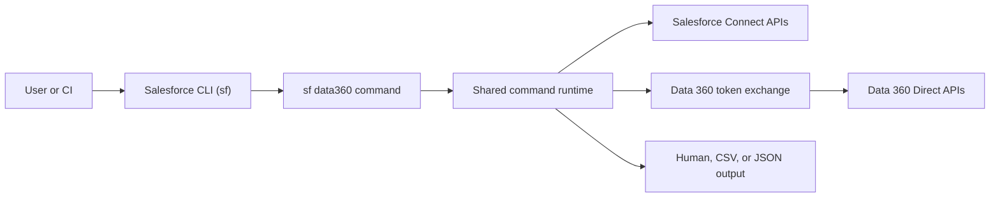

# Architecture

`sf-plugin-data360` is an oclif plugin hosted by the Salesforce CLI. Commands use Salesforce CLI org authentication, then call either Salesforce Connect APIs or exchange the org session for a short-lived Data 360 Direct API token.

## Repository layout

| Path                                            | Responsibility                                                                   |
| ----------------------------------------------- | -------------------------------------------------------------------------------- |
| `src/commands/data360/`                         | Thin oclif command entry points and command-specific flags.                      |
| `src/command/`                                  | Shared command lifecycle, org resolution, output, timing, and error handling.    |
| `src/client/`, `src/api/`                       | Authenticated transports, retries, pagination, proxy handling, and API errors.   |
| `src/query/`, `src/ingest/`, and domain folders | Data 360 workflows and resource-specific behavior.                               |
| `src/resources/`                                | Declarative resource definitions used by repeatable CRUD-style commands.         |
| `src/repl/`                                     | Interactive SQL session, history, formatting, and meta commands.                 |
| `messages/`                                     | User-facing command help and examples loaded through Salesforce Core messages.   |
| `schemas/`                                      | Generated JSON result schemas for automation consumers.                          |
| `test/`                                         | Unit, contract, mock-integration, package, security, and live-evidence tests.    |
| `testbed/`                                      | Scripted persona journeys used to exercise the packaged CLI in mock mode.        |
| `scripts/`                                      | Deterministic generators and release, security, package, and verification gates. |
| `docs/`                                         | Curated guides plus the generated complete command reference.                    |
| `examples/`                                     | Synthetic, reviewed payloads safe to ship with the npm package.                  |

## Command flow

1. oclif parses a command and the shared `Data360Command` runtime resolves the target org, API version, data space, output mode, and cancellation behavior.
2. Connect API commands reuse the authenticated Salesforce Core connection. Direct API commands perform a scoped token exchange and validate the tenant URL before a request leaves the process.
3. Domain services validate input, execute bounded requests, and normalize platform responses without hiding the underlying API status.
4. Human output goes to stdout, diagnostics go to stderr, and `--json` commands emit the stable envelope documented in [docs/CLI_CONTRACT.md](docs/CLI_CONTRACT.md).

## Sources of truth

- TypeScript command classes and `messages/` define the executable command surface and help text.
- `yarn build` regenerates `oclif.manifest.json`, `oclif.lock`, `command-snapshot.json`, `schemas/`, [docs/COMMAND_REFERENCE.md](docs/COMMAND_REFERENCE.md), and [VERIFICATION.md](VERIFICATION.md).
- Generated files are committed so reviewers can inspect release behavior without running generators. CI rejects stale or nondeterministic output.
- [VERIFICATION.md](VERIFICATION.md) records command-specific evidence. A successful related command never implies live coverage for another command.

## Security boundaries

- The plugin consumes existing Salesforce CLI org authentication. It does not persist the Salesforce Core org access token in its own cache.
- Direct API tenant tokens are short-lived, encrypted with Salesforce Core's keychain-backed crypto, stored with restrictive permissions, and can be bypassed with `--no-token-cache`.
- External tenant URLs, authorization-header overrides, redirects, path traversal, and unsafe proxy behavior fail closed.
- Destructive or billable operations require explicit flags and, where applicable, interactive confirmation.
- Public source, Git history, fixtures, and the npm tarball are checked independently for credentials, tenant identifiers, private working material, and unexpected files.

See [SECURITY.md](SECURITY.md) for disclosure and credential-handling policy and [docs/RELEASE.md](docs/RELEASE.md) for the exact release boundary.

## Distribution boundary

The npm package uses the explicit `files` allowlist in `package.json`, then `scripts/package-contents.mjs` applies a second allowlist to the packed tarball. Runtime code, messages, schemas, public user docs, examples, licenses, and the Data 360 mark ship. Tests, generators, live-test configuration, contributor-only runbooks, and ignored `internal/` material do not.
